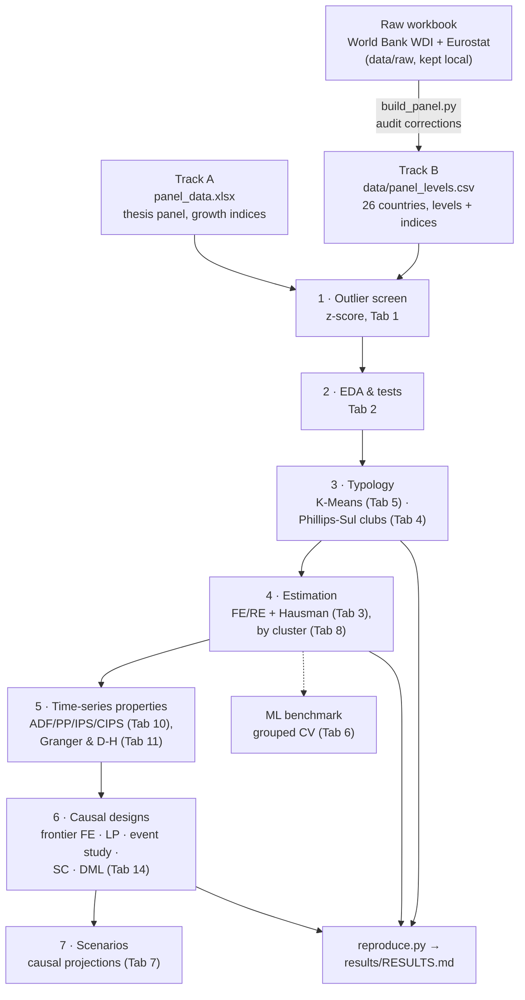

# Augmented Solow · R&D Heterogeneity Lab

[](https://github.com/andrm101/thesis-interface-build/actions/workflows/ci.yml)
[](https://github.com/andrm101/thesis-interface-build/actions/workflows/release.yml)
[](LICENSE)

> **Thesis interface for:**
> *An empirical investigation into the heterogeneous impact of R&D
> investment on economic productivity across 25 EU member states over a
> 25-year panel (1998–2023).*

An interactive desktop application (Tkinter + matplotlib) and a headless
reproduction script for the thesis's empirical work. It covers the original
workflow — **augmented Solow** panel models, a **K-Means** typology of
Innovative leaders vs. Emerging adopters, **FE / RE** with **Hausman**, and
**ADF / PP / IPS** unit roots — and extends it with data auditing,
convergence clubs, second-generation panel tests, leakage-safe machine
learning and **causal designs** (local projections, staggered event study,
synthetic control, double machine learning).

---

## Contents

1. [Quick start](#quick-start)
2. [Methodology](#methodology) — the pipeline, the two data tracks, and how to reach every result
3. [What reproduces — and what does not](#what-reproduces--and-what-does-not)
4. [Tab reference](#tab-reference)
5. [Data](#data) — rebuilding the panel, audit, schema, sources
6. [Project layout](#project-layout) · [Development](#development) · [Credits](#credits--licence)

---

## Quick start

**Windows, no Python needed:** download `EU-Innovation-Panel-windows.zip`
from the [latest release](https://github.com/andrm101/thesis-interface-build/releases/latest),
unzip, and run `EU-Innovation-Panel.exe`.

**From source** (Python ≥ 3.10):

```bash
git clone https://github.com/andrm101/thesis-interface-build.git
cd thesis-interface-build
pip install -r requirements.txt

python main.py                        # GUI, thesis panel (Track A) loaded
python main.py data/panel_levels.csv  # GUI, rebuilt level panel (Track B)
python reproduce.py                   # every headline result → results/RESULTS.md
```

On Linux, Tk comes from the system package manager (`sudo apt install
python3-tk`). A dark palette is the default; toggle the light palette from
the top-right corner for paper-ready screenshots.

---

## Methodology

### Pipeline



### The two data tracks

Both datasets are kept, because they answer different questions.

| | **Track A — thesis panel** | **Track B — rebuilt level panel** |
|---|---|---|
| File | `panel_data.xlsx` (default at startup) | `data/panel_levels.csv` (`python build_panel.py`) |
| Coverage | 23 countries, 2000-2023 | 26 countries (+ Austria, Cyprus, Slovakia), 1998-2023 |
| Variables | Year-on-year growth indices (prev. year = 100) + two levels | Levels (R&D % GDP, researchers per 1,000 employed, patents per million, tertiary share, output per worker, frontier gap, …) **and** the thesis-named indices rebuilt from corrected inputs |
| Known issues | `Human Capital Proxy` built from misaligned rows; Italy 2011 `Labor` typo; `Savings Percentage` not reproducible from the raw data — see [`docs/DATA_AUDIT.md`](docs/DATA_AUDIT.md) | Corrected |
| Use it for | Reproducing the thesis exactly as submitted | Corrected results, the typology, convergence clubs in levels, and every causal design |

### Step by step

Each step names the GUI location and the module that implements it, so the
same analysis can be run interactively or scripted.

**0 · Build the level panel** (Track B only) — `python build_panel.py`
parses each wide country × year block of the raw workbook by ISO code,
reads tertiary attainment from the correctly aligned sheet, fixes the
Czechia/Estonia researcher units, and derives intensities, log levels, a
frontier gap (distance to the mean of the top three countries' log output
per worker) and growth indices. `tests/test_build_panel.py` locks every
correction in place.

**1 · Outlier screen** — *Tab 1 → Z-score Outlier Screen* (`outliers.py`).
Enforced on *Apply Filters*: a country is dropped when its **mean** of a
model variable lies beyond |z| > 3 of the cross-country distribution.
Observation-level screening (within-country spikes) is available but off by
default, because its flags concentrate in 2009 and 2020 — genuine shocks.
Track A drops Luxembourg; Track B drops Luxembourg (patents per capita) and
Malta (tertiary-growth volatility).

**2 · Exploratory analysis** — *Tab 2* (`eda.py`). Ten test families —
normality, group differences, country heterogeneity, trends, pooled /
between / within correlations, Pesaran CD, variance decomposition, Chow
breaks, lead-lag — with Benjamini-Hochberg FDR correction wherever a test
runs over many variables, plus eleven figure types.

**3 · Typology**
- *Tab 5 → K = 2 → Run Clustering* on country means of the R&D variables.
  On Track B the tab defaults to the **level** variables (R&D % GDP,
  researchers per 1,000, patents per million, tertiary share).
- *Tab 4 → Club Clustering* (`clubs.py`): Phillips-Sul log-t test (HP
  trend, λ = 400; r = 0.3; HAC SEs), max-t core formation, sieve c* = 0 and
  Schnurbus et al. (2017) club merging. Tick *Chain growth index* for
  Track A; untick it and pick `Y_per_worker` for level clubs on Track B.
  *Use Clubs as Clusters* sends the clubs to Tabs 2 and 8.

**4 · Estimation** — *Tab 3*: log-transform on, *Fixed Effects (Entity +
Time)*, clustered SEs, then *Hausman Test*. Repeat per group via the Tab 1
**Innovative** / **Emerging** buttons, or run all clusters at once in
*Tab 8* (any number of clusters, with a χ²(K−1) test of coefficient
equality across clusters). For timing, set *Lag depth* and *Build Lag
Variables*.

**5 · Time-series properties** — *Tab 10* ADF / PP / KPSS / IPS and
**CIPS** (`panel_tests.py`; robust to common shocks, critical values
simulated for the panel's own N and T). *Tab 11* VAR / IRF / FEVD and
**Dumitrescu-Hurlin** panel Granger causality (levels and differences).

**6 · Causal designs** — *Tab 14* (`causal.py`), on Track B (*Load level
panel*):

| Design | Settings used for the reported results |
|---|---|
| Frontier FE regression | growth = Δ100·log `Y_per_worker`; R&D, gap and R&D × gap lagged one year; controls savings rate, tertiary share; two-way FE; clustered SE |
| Local projections | shock Δ`RD_pct_GDP`; h = 0…6; 2 lags; state = frontier gap above its median |
| Event study | EU accession 2004/2007/2013; never-treated **and** not-yet-treated controls, each with and without cohort pre-trend removal; country bootstrap |
| Synthetic control | Poland, 2004; donors = never-accession countries; pre-period demeaned; in-space placebos |
| Double ML | treatment `RD_pct_GDP`(t−1); controls lagged + country means; Random Forest and Lasso learners; CATE in frontier gap; by group |

**7 · Scenarios** — *Tab 7 → Causal Scenario* projects a country's output
per worker under a sustained R&D change from the Tab 14 estimates (not from
an ML fit), with 95 % bands against a trend baseline.

**ML benchmark** — *Tab 6* (`ml_eval.py`): cross-validation holds out whole
countries (or later years); the leaky random-K-fold R² is shown beside it;
*Held-out Importance* ranks features by out-of-sample value.

### Reaching every result

`python reproduce.py` regenerates all of the following into
[`results/RESULTS.md`](results/RESULTS.md) (≈ 2 minutes; `--quick` for a
fast pass). IDs refer to sections of that file.

| ID | Result | Track | In the GUI |
|---|---|---|---|
| A1 / B1 | Outlier screen | A / B | Tab 1 → Apply Filters (status bar), *Screen Report…* |
| A2 | Panel FE + Hausman | A | Tab 3 → Run Model, Hausman Test |
| A3 / B3 | GERD paradox by group | A / B | Tab 1 Innovative / Emerging → Tab 3 (or Tab 8) |
| A3b | Timing: R&D lagged 0-4 years | A | Tab 3 → Lag depth → Build Lag Variables |
| A4 / B2 | K-Means typology | A / B | Tab 5 → K = 2 → Run Clustering |
| A5 / B4 | Phillips-Sul clubs | A / B | Tab 4 → Club Clustering |
| A6 | ML, honest vs leaky CV | A | Tab 6 → Train & Evaluate |
| B5 | CIPS unit roots | B | Tab 10 → CIPS / CIPS — All |
| B6 | Dumitrescu-Hurlin causality | B | Tab 11 → select variables → Panel Granger (D-H) |
| B7 | Distance-to-frontier regression | B | Tab 14 → Frontier Regression |
| B8 | Local projections | B | Tab 14 → Local Projections |
| B9 | EU-accession event study | B | Tab 14 → Event Study (toggle controls / detrend) |
| B10 | Synthetic control | B | Tab 14 → Synthetic Control |
| B11 / B12 | Double ML and its sensitivity | B | Tab 14 → Double ML (vary learner; Tab 1 country filter) |
| — | Causal scenario | B | Tab 7 → Causal Scenario |

---

## What reproduces — and what does not

Summary of `results/RESULTS.md`. Significance: \* 10 %, \*\* 5 %, \*\*\* 1 %.

| Thesis claim | Evidence here | Verdict |
|---|---|---|
| Two typologies: Nordic / Central-European leaders vs. Eastern / Southern adopters | Track A K-Means (growth indices): 77 % agreement, silhouette 0.24. **Track B K-Means on R&D levels: 100 % agreement**, silhouette 0.36 (B2) | ✅ with level data |
| Savings rate is the most robust driver | Track A: positive in all samples (\*\*\*). Track B: positive, weaker (\*\* overall, n.s. for Innovative) | ✅ Track A, ◐ Track B |
| GERD paradox: negative aggregate, **positive in leaders** | Same-year R&D growth is **negative** for the Innovative group in every FE variant, on both tracks (A3, B3). Lagged 1-3 years it turns positive (A3b) — a **J-curve**. DML finds a positive Innovative effect in 7 of 8 specifications, not significant in the default one (B11, B12) | ✗ as stated; ◐ with lags |
| R&D effect declines with distance to the frontier | DML CATE slope negative in 7/8 cells, significant at 5 % in 6/8, but not in the default sample with the Random Forest learner (B12); frontier-FE interaction n.s. (B7) | ◐ suggestive |
| Hausman prefers FE | χ²(6) = 10.7, p = 0.099 (A2) | ◐ at 10 % only |
| Conditional β-convergence | Frontier gap strongly positive in growth regressions (B7); log-t rejects global convergence but finds clubs (A5, B4) | ✅ conditional / club |
| Levels I(1), growth rates I(0) | CIPS: log output per worker unit root; growth index stationary (B5) | ✅ |
| R&D drives productivity | Dumitrescu-Hurlin: **productivity Granger-causes R&D**, not the reverse (B6); local projections n.s. (B8) | ✗ — reverse causality |
| EU accession accelerated catch-up | +14 % naive ATT, but strong pre-trends; −4.5 % to +3.4 % after adjustment (B9) | ✗ not identified |

The honest one-line summary: **the typology and the club structure hold;
the GERD-paradox reversal holds only with lags; and productivity leads R&D
rather than the other way round.**

---

## Tab reference

| Tab | What it does |
|---|---|
| **1 · Data** | Load, filter by year / country group (EU-25, Innovative, Emerging, West, East), z-score outlier screen, panel-structure report, transformations (growth, log, differences), HP filter, rolling statistics. |
| **2 · Statistics** | Ten test families with FDR correction (*Run All Tests*) and eleven EDA figures; groups = a-priori clusters or Tab 5 / Tab 4 clusters. |
| **3 · Panel FE / RE** | Pooled / FE / FE + time / RE / IV-FD; clustered SEs; Hausman; lag builder; significance forest plot. |
| **4 · Convergence** | Absolute and conditional β-convergence, σ-convergence, Phillips-Sul log-t test and convergence clubs. |
| **5 · Clustering** | K-Means with elbow plot and PCA biplot; defaults to level R&D variables when present. |
| **6 · ML Models** | RF / GB / Ridge / Lasso with grouped or forward-chaining CV, leaky-CV reference, held-out permutation importance. |
| **7 · Scenarios** | Thesis ML simulator, J-curve simulator, and the **Causal Scenario** projection. |
| **8 · Compare** | Cluster-wise regressions for any number of clusters, forest plot, coefficient-equality test. |
| **9 · Diagnostics** | Residual normality, White heteroskedasticity, serial correlation, CUSUM. |
| **10 · Unit Roots** | ADF, PP, KPSS, IPS, **CIPS**, Engle-Granger, Johansen. |
| **11 · VAR / IRF** | Lag selection, VAR, IRF / cumulative IRF, FEVD, forecasts, Granger, **Dumitrescu-Hurlin**, VECM, local-projection IRFs. |
| **12 · Advanced** | Interactions, Driscoll-Kraay SEs, mean-group, quantile and threshold regressions. |
| **13 · Report** | HTML report, figure export, text export. |
| **14 · Causal** | Frontier FE, local projections, staggered event study, synthetic control, double ML. |

The 18 literature-based hypotheses and the tab that tests each are listed in
[`docs/HYPOTHESES.md`](docs/HYPOTHESES.md).

---

## Data

### Rebuilding the level panel

```bash
python build_panel.py                       # data/raw/BD_Licenta.xlsx → data/panel_levels.csv
python build_panel.py path/to/raw.xlsx -o out.csv
```

The raw workbook is kept **out of the public repository** (`data/raw/` is
git-ignored); the rebuilt `data/panel_levels.csv` is committed, so every
Track B result reproduces without it. `tests/test_build_panel.py` skips when
the raw file is absent.

### Data audit

[`docs/DATA_AUDIT.md`](docs/DATA_AUDIT.md) documents the cell-by-cell
comparison of `panel_data.xlsx` with the raw workbook: how each thesis
column was built, the misaligned human-capital rows, the researcher unit
slip, the Italy 2011 typo, and the non-reproducible savings series.

### Schema

Any long-form panel with `Country` and `Year` loads; numeric columns appear
in every dropdown. The thesis columns are:

| Column | Meaning (verified against raw data) |
|---|---|
| `Y by L` | GDP per capita (const. 2015 US$), growth index — per capita, not per worker |
| `PIB towards research` | R&D expenditure % GDP, growth index |
| `Patents per capita` | resident patent applications per capita, growth index |
| `Human Capital Proxy` | tertiary attainment, growth index (misaligned in Track A) |
| `Labor in research` | researchers / population (level) |
| `Savings Percentage` | savings share (Track A: unverified; Track B: gross savings / GDP) |
| `Labor`, `Population` | employment and population, growth indices |
| `TFP Growth Rate`, `A` | TFP measures — near-mechanical predictors of `Y by L` |

Track B adds the level variables listed in `build_panel.py`.

### Extending the data

[`docs/DATA_SOURCES.md`](docs/DATA_SOURCES.md) lists open sources for the
variables still missing — government R&D budgets (GBARD), OECD R&D
tax-incentive rates and introduction dates, AMECO fiscal balances, EU
Cohesion and Horizon funding, governance indicators. The Tab 14 designs
take them directly (e.g. custom events `Poland:2016, Slovakia:2015`).

---

## Project layout

```
thesis-interface-build/
├── main.py                  # GUI entry point
├── reproduce.py             # headless reproduction → results/RESULTS.md
├── build_panel.py           # raw workbook → data/panel_levels.csv
├── app.py                   # ThesisApp shell (mixins)
├── theme.py · constants.py · helpers.py
├── outliers.py              # z-score screen
├── eda.py                   # EDA test battery
├── clubs.py                 # Phillips-Sul clubs
├── ml_eval.py               # leakage-safe CV, held-out importance
├── panel_tests.py           # CIPS, Dumitrescu-Hurlin
├── causal.py                # frontier FE, LP, event study, SC, DML, scenarios
├── panel_data.xlsx          # Track A: thesis panel
├── data/
│   ├── panel_levels.csv     # Track B: rebuilt level panel
│   └── raw/                 # raw workbook (local, git-ignored)
├── results/RESULTS.md       # output of reproduce.py
├── tabs/                    # one mixin per GUI tab (1-14)
├── docs/                    # DATA_AUDIT, DATA_SOURCES, HYPOTHESES
├── tests/                   # pytest (data, modules, planted-effect recovery, GUI smoke)
└── .github/workflows/       # CI and Windows release build
```

---

## Development

```bash
pip install -r requirements-dev.txt
ruff check --select E9,F63,F7,F82 .   # syntax errors / undefined names
python -m pytest                      # add `xvfb-run -a` on headless Linux
python reproduce.py --quick           # end-to-end smoke run of every analysis
```

The causal and convergence estimators are tested by **recovering planted
effects** from synthetic data (known ATT, synthetic-control weights, LP
responses, DML θ and CATE, CIPS / Dumitrescu-Hurlin size and power, two
planted convergence clubs). CI runs lint and the full suite on Python 3.10
and 3.12 for every push and pull request.

### Releasing a Windows build

```bash
git tag v1.1.0 && git push origin v1.1.0
```

`.github/workflows/release.yml` builds the app with PyInstaller on a Windows
runner, bundles `panel_data.xlsx`, and attaches
`EU-Innovation-Panel-windows.zip` to a GitHub Release (or run it manually
from the **Actions** tab).

---

## Credits & licence

Built as a companion tool for Andrei's thesis on R&D heterogeneity in EU
growth. Released under the [MIT licence](LICENSE) — drop a link back to the
repo if you build on it.
