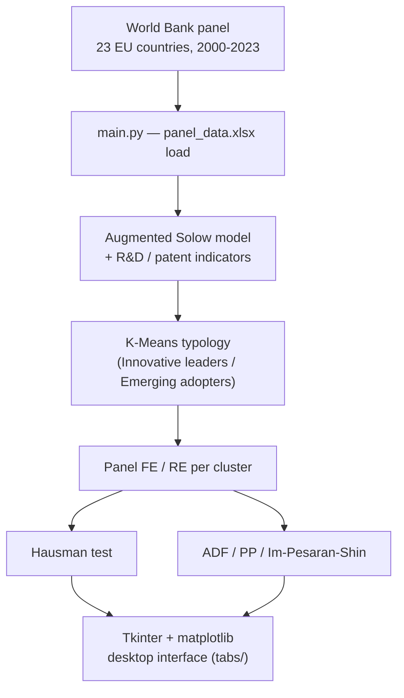

# Augmented Solow · R&D Heterogeneity Lab

[](https://github.com/andrm101/thesis-interface-build/actions/workflows/ci.yml)
[](https://github.com/andrm101/thesis-interface-build/actions/workflows/release.yml)
[](LICENSE)

> **Thesis interface for:**
> *An empirical investigation into the heterogeneous impact of R&D
> investment on economic productivity across 25 EU member states over a
> 25-year panel (1998–2023).*
>
> **Shipped sample:** the `panel_data.xlsx` bundled here covers **23 countries, 2000–2023** (24 years, 552 rows) — Austria, Cyprus, and Ireland from the thesis's original EU-25/1998 scope are not present in this shipped subsample.

An interactive desktop application (Tkinter + matplotlib) that reproduces
the empirical workflow of the thesis end-to-end. It loads a World-Bank
panel of EU economies, lets you build and estimate an **augmented
Solow model** enriched with R&D and patent indicators, runs a **K-Means
typology** to separate Innovative leaders from Emerging adopters, and
then estimates **panel FE / RE** models inside each cluster — validating
the specification with the **Hausman test** and confirming stationarity
with **ADF / PP / Im-Pesaran-Shin** unit-root tests.

---

## Thesis in one paragraph

The study extends the Solow-Swan growth framework with R&D expenditure
(GERD) and patent activity as innovation proxies. K-Means clustering
partitions the 25 EU economies into two structurally distinct
typologies — Nordic / Central-European innovation leaders and
Eastern / Southern emerging adopters. Panel fixed-effects and
random-effects models are estimated separately within each cluster, with
Hausman tests guiding the specification choice. The main finding
resolves the **GERD paradox**: an aggregate negative relationship
between R&D spending and productivity disappears once the sample is
split, revealing strong positive effects in innovator economies that
were masked by the low absorptive capacity of emerging ones. **Savings
rate** is the most robust productivity driver across all specifications,
and **conditional β-convergence** is confirmed in both clusters through
significantly negative initial-GDP coefficients.

---

## Architecture



## Quick start

**Windows, no Python needed:** download `EU-Innovation-Panel-windows.zip`
from the [latest release](https://github.com/andrm101/thesis-interface-build/releases/latest),
unzip, and run `EU-Innovation-Panel.exe`.

**From source** (Python ≥ 3.10):

```bash
git clone https://github.com/andrm101/thesis-interface-build.git
cd thesis-interface-build
pip install -r requirements.txt

python main.py                    # opens with the bundled panel_data.xlsx loaded
python main.py my_panel.csv       # or start with your own panel
```

On Linux, Tk comes from the system package manager (`sudo apt install python3-tk`).

On Windows the app opens maximised and applies per-monitor DPI
awareness. A dark "Palantir" palette is the default; toggle to the
light "Claude" palette from the top-right corner for paper-ready
screenshots.

---

## How to run the analysis for thesis-matching results

The interface is organised as a linear 13-tab pipeline. Following the
tabs top-to-bottom reproduces the empirical workflow of the thesis.

### 1 · Data
1. The bundled `panel_data.xlsx` (552 rows × 16 cols, long-form
   country × year) is loaded automatically at startup. Use **Browse…**
   to switch to another file.
2. Leave the year range at **2000 – 2023**.
3. Click **EU-25** (or **Innovative** / **Emerging** if you already want
   to focus on one cluster).
4. Hit **Apply Filters**. The status bar should read *"528 obs · 22
   countries · z-screen: excluded Luxembourg"*.
   The **Z-score Outlier Screen** panel is enforced by default: countries
   whose *mean* on a model variable lies beyond |z| > 3 of the
   cross-country distribution are dropped. On the shipped data this
   removes only **Luxembourg** (Human Capital Proxy z ≈ +3.3, Savings
   z ≈ +3.5, Patents per capita z ≈ +3.1). Options: threshold, classic vs.
   robust (median/MAD) z, country vs. observation (within-country) level,
   and NaN / winsorize / drop for flagged cells. **Screen Report…** shows
   the flags and a z-score heatmap. Observation-level flags cluster in
   2009 and 2020 — genuine shocks — so the default screens countries only.
5. Optional but recommended: click **Panel Structure Report** — it
   prints whether the panel is balanced and a per-variable missingness
   table. Expect a balanced 22 × 24 = 528-cell grid.
6. In **Data Transformation Tools**, pre-build:
   - `Y by L → Log-Level` (for productivity).
   - `PIB towards research → Log-Level`.
   - `Patents per capita → Growth Rate (%)` if you want a "patent
     intensity" flow variable.

### 2 · Statistics  *(exploratory data analysis)*
Pick a **Variable / X**, an **Outcome Y**, and the **Groups** (a-priori
Innovative/Emerging, or the K-Means clusters from Tab 5).

**Tests** (▶ *Run All Tests* runs every family; p-values carry
Benjamini-Hochberg FDR adjustments — see `eda.py`):
summary · normality (Shapiro-Wilk, Jarque-Bera, D'Agostino) · group
differences (Welch, Mann-Whitney, KS, Levene, Cohen's d) · country
heterogeneity (ANOVA, Kruskal-Wallis, η²) · trends (Mann-Kendall) ·
pooled / between / within correlations · Pesaran CD · between/within
variance decomposition · Chow structural breaks (2004, 2008, 2009, 2013,
2020) · lead-lag correlations.

**Figures**: correlation heatmap · distributions by group · Q-Q plots ·
trajectories with group median ± IQR · box plots by country · country ×
year heatmap · z-score map · scatter matrix · X-vs-Y by group (pooled and
within) · lead-lag correlogram · between/within variance bars.

### 3 · Panel FE / RE  *(core estimation)*
1. **Dependent variable**: `Y by L` (output per worker).
2. **Regressors** (default pre-selected): Savings Percentage, Human
   Capital Proxy, Labor in research, PIB towards research, Patents per
   capita, Labor not in research.
3. **Model**: start with *Fixed Effects (Entity + Time)* — the thesis'
   preferred within estimator.
4. Keep **Log-transform** ON and **Clustered SE (entity)** ON.
5. (Optional) set *Lag depth for regressors* to `1` and click **Build
   Lag Variables** to reproduce the dynamic specification.
6. Click **Run Model**. Cross-check with **Hausman Test (FE vs RE)** —
   you should reject H₀ ⇒ prefer Fixed Effects.
7. **Plot Significant Variables** renders the forest plot used in the
   thesis' Figure 4.

Repeat separately for the **Innovative** and **Emerging** filters
(set in Tab 1) to reproduce the cluster-wise results that resolve the
GERD paradox.

### 4 · Convergence
Run a cross-sectional OLS of average productivity growth on
**initial log-GDP** to test **β-convergence**. Do it once for each
cluster — both slopes should be negative and significant, confirming
conditional convergence.

### 5 · Clustering  *(the typology)*
1. Keep the default variables selected: **PIB towards research**,
   **Labor in research**, **Patents per capita**, **Human Capital
   Proxy**.
2. **K = 2**.
3. Click **Elbow Plot** — the annotated bend at K = 2 confirms the
   choice.
4. Click **Run Clustering**. The text panel lists cluster membership
   and auto-labels the high-R&D group as **Innovative** and the other
   as **Emerging**.
5. Click **PCA Biplot** for the two-dimensional visualisation with
   loading arrows — this mirrors the thesis' country-typology figure.

### 6 · ML Models
Train supervised models (Random Forest, Gradient Boosting, etc.) using
the same productivity target. The ML results are benchmarks for the
econometric models — they should match the sign and rank of the key
drivers identified by the panel FE specification.

### 7 · Scenarios
Counterfactuals: move a country's R&D intensity to the cluster mean and
re-predict productivity. Quantifies the absorptive-capacity channel
behind the GERD paradox.

### 8 · Compare
Side-by-side regression table (Pooled / FE / RE / FE+Time) — the
Table-2 equivalent of the thesis.

### 9 · Diagnostics
Residual normality, heteroskedasticity (White test), serial correlation,
and cross-sectional dependence checks.

### 10 · Unit Roots
**ADF**, **PP**, and **Im-Pesaran-Shin** panel unit-root tests. Reject
the null of a unit root for log-differenced variables before using them
in the panel specification.

### 11 · VAR / IRF
Vector autoregression and impulse-response functions — R&D shock → TFP
and Output responses. Supplementary to the main specification.

### 12 · Advanced
Non-linear and interaction specifications (R&D × Human Capital, etc.).

### 13 · Report
Export any tab's text panel to `.txt` and summarise model fits in a
single consolidated report.

---

## Matching the thesis' reported results

| Thesis finding | Where to reproduce | Expected sign |
|---|---|---|
| K-Means identifies 2 typologies | Tab 5 · Clustering (K=2) | Innovative / Emerging split matching `constants.INNOVATIVE_CLUSTER` and `EMERGING_CLUSTER`. |
| GERD paradox: negative aggregate, positive in leaders | Tab 3 · Panel FE with whole EU-25 then Innovative only | EU-25 coef on R&D ≤ 0; Innovative coef > 0 at 5 %. |
| Savings rate is the strongest driver | Tab 3 · every FE/RE run | Positive and *** across all specs. |
| Conditional convergence | Tab 4 · Convergence (per cluster) | Negative, significant β on initial log-GDP. |
| Hausman prefers FE | Tab 3 · Hausman button | χ² p < 0.05 ⇒ reject RE. |
| Variables are I(1) in levels, I(0) in log-diffs | Tab 10 · Unit Roots | ADF/PP/IPS reject stationarity on levels, fail to reject on log-differences. |

---

## Extending the data & hypotheses

- [`docs/DATA_SOURCES.md`](docs/DATA_SOURCES.md) — open sources (Eurostat,
  OECD, Penn World Table, AMECO, EU Cohesion, CORDIS, WGI) for R&D
  intensity levels, fiscal-policy variables and R&D tax-incentive dates.
- [`docs/HYPOTHESES.md`](docs/HYPOTHESES.md) — 18 literature-based
  hypotheses mapped to the tab that tests them, or the data they need.

> **Note on the shipped data:** most columns are year-on-year growth
> indices (previous year = 100), not levels — see `DATA_SOURCES.md`.

---

## Expected dataset schema

The app was built around the shipped `panel_data.xlsx`, but it accepts
any long-form panel with at least the columns below:

| Column | Role | Notes |
|---|---|---|
| `Country` | Entity | String, one per country. |
| `Year` | Time | Integer. |
| `Y by L` | Dependent (productivity) | Output per worker. |
| `Savings Percentage` | Key driver | Gross-savings share of GDP. |
| `Human Capital Proxy` | Key driver | Any schooling/education index. |
| `Labor in research` | R&D labour | Researchers, FTE. |
| `Labor not in research` | Residual labour | Complement to the above. |
| `PIB towards research` | GERD intensity | R&D as % of GDP. |
| `Patents per capita` | Innovation output | Patent applications normalised. |
| `Patents`, `Patents per hour` | Optional extra innovation proxies | |
| `Population`, `Labor` | Scale variables | |
| `TFP Growth Rate`, `A` | Total factor productivity | Computed exogenously. |

Other columns are tolerated — the app infers numeric variables
automatically and offers them in every dropdown.

---

## Project layout

```
thesis-interface-build/
├── main.py                  # entry point — run this
├── app.py                   # ThesisApp shell (multiple-inheritance of mixins)
├── theme.py                 # palettes, ttk styles, matplotlib defaults
├── constants.py             # EU groupings + thesis clusters + helpers
├── helpers.py               # shared UI + plot embedding helpers
├── outliers.py              # z-score outlier screen (country / observation)
├── eda.py                   # EDA test battery (normality, groups, CD, breaks…)
├── panel_data.xlsx          # shipped sample: 23 countries, 2000-2023
├── tabs/
│   ├── tab_data.py          # 1 · Data         — loading, filtering, transforms
│   ├── tab_stats.py         # 2 · Statistics   — EDA tests + figures
│   ├── tab_panel.py         # 3 · Panel FE/RE  — core estimation + Hausman
│   ├── tab_convergence.py   # 4 · Convergence  — cross-sectional β-convergence
│   ├── tab_clustering.py    # 5 · Clustering   — K-Means typology + PCA biplot
│   ├── tab_ml.py            # 6 · ML Models    — RF/GB/XGB benchmarks
│   ├── tab_scenarios.py     # 7 · Scenarios    — counterfactual R&D shocks
│   ├── tab_compare.py       # 8 · Compare      — side-by-side regression table
│   ├── tab_diagnostics.py   # 9 · Diagnostics  — White, BG, CD tests
│   ├── tab_unitroot.py      # 10 · Unit Roots  — ADF, PP, Im-Pesaran-Shin
│   ├── tab_var.py           # 11 · VAR / IRF   — impulse responses
│   ├── tab_advanced.py      # 12 · Advanced    — interactions, non-linearities
│   └── tab_report.py        # 13 · Report      — consolidated export
├── docs/                    # data-source catalogue + hypothesis catalogue
├── tests/                   # pytest: dataset checks + headless GUI smoke test
├── .github/workflows/       # CI (lint + tests) and Windows release build
├── requirements.txt         # runtime dependencies
├── requirements-dev.txt     # + pytest, ruff
└── README.md                # this file
```

---

## Methods checklist (from the thesis abstract)

- [x] Augmented Solow model (GERD + patents)
- [x] K-Means clustering (K = 2)
- [x] Panel Fixed Effects / Random Effects
- [x] Hausman specification test
- [x] Unit root testing — ADF, PP, Im-Pesaran-Shin
- [x] Cross-sectional OLS (β-convergence)
- [x] White heteroscedasticity test

Every one of the above is exposed as a button in the GUI.

---

## Development

```bash
pip install -r requirements-dev.txt
ruff check --select E9,F63,F7,F82 .   # syntax errors / undefined names
python -m pytest                      # data checks + headless GUI smoke test
```

The GUI smoke test needs a display; on a headless Linux box run it under
`xvfb-run -a python -m pytest`. CI (`.github/workflows/ci.yml`) does exactly
this on every push and pull request.

### Releasing a Windows build

```bash
git tag v1.1.0 && git push origin v1.1.0
```

`.github/workflows/release.yml` builds the app with PyInstaller on a Windows
runner, bundles `panel_data.xlsx`, and attaches
`EU-Innovation-Panel-windows.zip` to a GitHub Release. You can also run the
workflow manually from the **Actions** tab to get the zip as a build artifact.

---

## Credits & licence

Built as a companion tool for Andrei's master-thesis on R&D
heterogeneity in EU growth. Released under the [MIT licence](LICENSE) —
drop a link back to the repo if you build on it.
