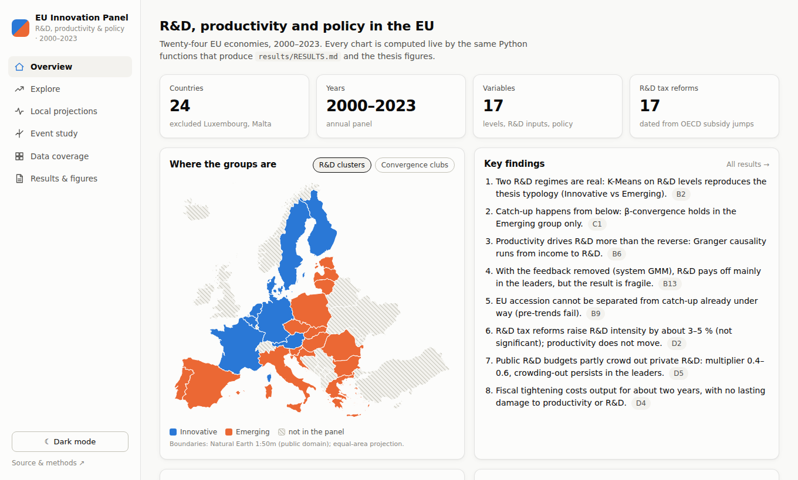
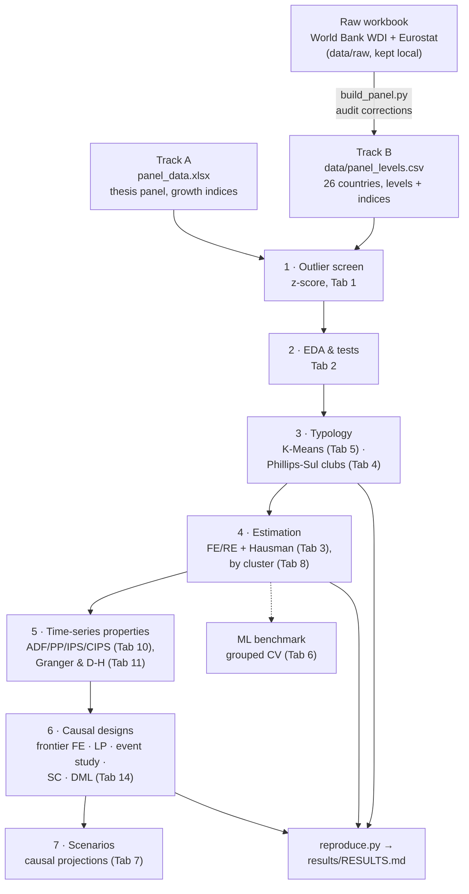

# Augmented Solow · R&D Heterogeneity Lab

[](https://github.com/andrm101/thesis-interface-build/actions/workflows/ci.yml)
[](https://github.com/andrm101/thesis-interface-build/actions/workflows/release.yml)
[](LICENSE)

> **Thesis interface for:**
> *An empirical investigation into the heterogeneous impact of R&D
> investment on economic productivity across 25 EU member states over a
> 25-year panel (1998–2023).*

An interactive desktop application (Tkinter + matplotlib) and a headless
reproduction script for the thesis's empirical work. It covers the original
workflow — **augmented Solow** panel models, a **K-Means** typology of
Innovative leaders vs. Emerging adopters, **FE / RE** with **Hausman**, and
**ADF / PP / IPS** unit roots — and extends it with data auditing,
convergence clubs, second-generation panel tests, leakage-safe machine
learning and **causal designs** (local projections, staggered event study,
synthetic control, double machine learning).

---

## Contents

1. [Quick start](#quick-start) · [Web dashboard](#web-dashboard-angular--fastapi)
2. [Key findings and interpretation](#key-findings-and-interpretation)
3. [Methodology](#methodology) — the pipeline, the two data tracks, and how to reach every result
4. [What reproduces — and what does not](#what-reproduces--and-what-does-not)
5. [Tab reference](#tab-reference)
6. [Data](#data) — rebuilding the panel, audit, schema, sources
7. [Project layout](#project-layout) · [Development](#development) · [Credits](#credits--licence)

A longer, figure-illustrated version of the findings lives in the
[project wiki](https://github.com/andrm101/thesis-interface-build/wiki); its
source is [`docs/wiki/`](docs/wiki), published automatically by
`.github/workflows/wiki.yml` on every push to `main`.

---

## Quick start

**Windows, no Python needed:** download `EU-Innovation-Panel-windows.zip`
from the [latest release](https://github.com/andrm101/thesis-interface-build/releases/latest),
unzip, and run `EU-Innovation-Panel.exe`.

**From source** (Python ≥ 3.10):

```bash
git clone https://github.com/andrm101/thesis-interface-build.git
cd thesis-interface-build
pip install -r requirements.txt

python main.py                        # GUI, thesis panel (Track A) loaded
python main.py data/panel_levels.csv  # GUI, rebuilt level panel (Track B)
python reproduce.py                   # every headline result → results/RESULTS.md
```

On Linux, Tk comes from the system package manager (`sudo apt install
python3-tk`). A dark palette is the default; toggle the light palette from
the top-right corner for paper-ready screenshots.

### Web dashboard (Angular + FastAPI)

A browser version of the main analyses: an Angular front end on a FastAPI
back end that calls the **same Python functions** as the desktop app and
`reproduce.py`, so its numbers match `results/RESULTS.md`.



| Page | What it shows |
|---|---|
| Overview | key figures, a map of the R&D clusters / convergence clubs, the typology (PCA), club transition paths, key findings |
| Explore | any variable over time with up to six highlighted countries; a choropleth map of Europe with a year slider and *Play* animation (click a country to highlight it); ranking by year |
| Local projections | live impulse responses with 95 % bands; presets for D4, D5 and B8; split by group |
| Event study | Callaway-Sant'Anna on EU accession, R&D tax reforms or your own `Country:Year` events |
| Data coverage | share of years with data, country × variable |
| Results & figures | every `RESULTS.md` section rendered, plus the thesis figures (PNG/PDF) |

Light and dark themes, phone-width layout, and the colour-blind-validated
palette of the thesis figures.

**Run it anywhere with Docker** (nothing else to install):

```bash
docker compose up --build            # → http://localhost:8000
```

**Or locally** (Python ≥ 3.10, Node ≥ 22.22.3 or 24 LTS):

```bash
pip install -r requirements-api.txt
cd web && npm ci && npm run build && cd ..
uvicorn api.main:app --port 8000     # API + built app → http://localhost:8000
```

**While developing the front end**, run the API with `uvicorn api.main:app
--reload` and, in `web/`, `npm start`: the Angular dev server
(http://localhost:4200) reloads on save and proxies `/api` to port 8000.
API documentation is generated at http://localhost:8000/docs.

---

## Key findings and interpretation

The thesis argues that R&D raises productivity in innovation leaders but
not (yet) in catch-up economies, whose low absorptive capacity masks the
effect in pooled data — the "GERD paradox". Taken together, the evidence
supports the *direction* of that argument, but for a different reason than
the one originally given, and with less certainty. IDs refer to
[`results/RESULTS.md`](results/RESULTS.md); figures are in
[`results/figures/`](results/figures).

1. **Two R&D regimes are real.** Clustering countries on R&D *levels*
   (intensity, researchers, patents, tertiary education) recovers the
   thesis typology exactly — Austria, Belgium, Denmark, Finland, France,
   Germany, Netherlands, Sweden vs. sixteen Eastern and Southern economies
   (B2, Fig. 1). The original clustering on growth rates could not show
   this (77 % agreement).
2. **The catch-up is happening, but only from below.** Emerging economies
   converge fast — about 3 % of the gap closes per year (C1, Fig. 7) — and
   productivity falls into three convergence clubs rather than one EU path
   (B4, Fig. 2). Among the leaders there is no convergence: the initially
   richest grew slightly faster.
3. **Productivity drives R&D more than R&D drives productivity.**
   Dumitrescu-Hurlin tests find causality from productivity to R&D, not the
   reverse (B6): countries spend more on R&D *after* they get richer. This
   is why fixed-effects regressions of productivity on same-year R&D are
   misleading — they return a *negative* R&D coefficient for the leaders
   (A3, B3) that turns positive after one to three years, a J-curve
   (A3b, Fig. 3).
4. **Once that feedback is removed, R&D pays off — mainly in the leaders.**
   System GMM treats R&D as endogenous. In the two specifications that pass
   every diagnostic, R&D is positive and significant (B13, Fig. 5): a 10 %
   larger R&D knowledge stock per worker raises output per worker by about
   0.5 % in the short run (same year, holding past productivity fixed), and
   +0.1 pp of GDP spent on R&D by about 0.36 %. The effect is concentrated in the Innovative economies and
   smaller in the Emerging ones — the thesis's direction.
5. **…but the evidence is fragile.** The GMM result holds only with
   shallow instrument lags; deeper lags lose significance and show weak
   instruments. Double ML finds the R&D effect shrinking with distance to
   the frontier in most specifications, but not robustly (B12, Fig. 6).
   Long-run effects are imprecise because productivity is so persistent.
6. **Savings matter; EU accession, as measured here, cannot be separated
   from the catch-up already under way.** Savings are the most consistent
   driver on the thesis panel (A2, A3). The apparent +14 % accession effect
   disappears once pre-existing trends are accounted for (B9, Fig. 4).
7. **Productivity growth is hard to predict.** Honest cross-validation
   gives out-of-sample R² of about 0.05 and negative R² for forecasting
   later years (A6) — a caution against reading much into ML scenario tools.
8. **R&D tax incentives raise R&D spending a little, not productivity (yet).**
   Seventeen generosity reforms dated from the OECD tax-subsidy series (e.g.
   Czechia 2005, Lithuania 2008, Slovakia 2015, Poland 2016, Germany 2020)
   pass the parallel-trends check. R&D intensity rises by about 3-5 % after a
   reform, growing to 6-10 % after five years, but with wide intervals; output
   per worker does not respond within five years (D2, Fig. 8).
9. **Public R&D budgets partly crowd out private R&D, above all in the
   leaders.** A 1 pp of GDP rise in government R&D budgets (GBARD) raises
   total R&D intensity by only 0.4-0.6 pp: R&D not financed by the budget
   falls. In the Emerging group that dip fades within two years, whereas
   in the Innovative group it persists at about −0.6 pp (D5).
10. **Fiscal tightening costs output briefly, not productivity for good.**
   The headline balance suggests tightening precedes faster growth, but
   that is the business cycle. With the cyclically adjusted balance (AMECO)
   a 1 pp tightening lowers output per worker by about 0.4 % for two years,
   and the effect fades to zero by year 3. R&D intensity does not fall, so
   there is no sign of hysteresis (D4).

**How to phrase it in the thesis.** Present the GERD paradox as a problem of
*timing and reverse causality* rather than of aggregation alone: R&D
follows income, and its payoff arrives with a lag and mainly where
absorptive capacity is high. Report the GMM estimates with their
diagnostics and the specification grid, and state the data corrections
(`docs/DATA_AUDIT.md`), since `Human Capital Proxy` in the submitted panel
is misaligned.

**Limitations.** 24 countries and 24 years (small N for GMM and clustering);
the thesis panel stores growth indices, not levels; the causal designs have
policy data are near-complete for 2000-2023 (`data/policy_coverage.csv`),
but R&D by source of funds is proxied (total R&D minus the public budget);
log productivity has a unit root (B5), so level regressions rely on the
dynamic specifications.

---

## Methodology

### Pipeline



### The two data tracks

Both datasets are kept, because they answer different questions.

| | **Track A — thesis panel** | **Track B — rebuilt level panel** |
|---|---|---|
| File | `panel_data.xlsx` (default at startup) | `data/panel_levels.csv` (`python build_panel.py`) |
| Coverage | 23 countries, 2000-2023 | 26 countries (+ Austria, Cyprus, Slovakia), 1998-2023 |
| Variables | Year-on-year growth indices (prev. year = 100) + two levels | Levels (R&D % GDP, researchers per 1,000 employed, patents per million, tertiary share, output per worker, frontier gap, …) **and** the thesis-named indices rebuilt from corrected inputs |
| Known issues | `Human Capital Proxy` built from misaligned rows; Italy 2011 `Labor` typo; `Savings Percentage` not reproducible from the raw data — see [`docs/DATA_AUDIT.md`](docs/DATA_AUDIT.md) | Corrected |
| Use it for | Reproducing the thesis exactly as submitted | Corrected results, the typology, convergence clubs in levels, and every causal design |

### Step by step

Each step names the GUI location and the module that implements it, so the
same analysis can be run interactively or scripted.

**0 · Build the level panel** (Track B only) — `python build_panel.py`
parses each wide country × year block of the raw workbook by ISO code,
reads tertiary attainment from the correctly aligned sheet, fixes the
Czechia/Estonia researcher units, and derives intensities, log levels, a
frontier gap (distance to the mean of the top three countries' log output
per worker) and growth indices. `tests/test_build_panel.py` locks every
correction in place.

**1 · Outlier screen** — *Tab 1 → Z-score Outlier Screen* (`outliers.py`).
Enforced on *Apply Filters*: a country is dropped when its **mean** of a
model variable lies beyond |z| > 3 of the cross-country distribution.
Observation-level screening (within-country spikes) is available but off by
default, because its flags concentrate in 2009 and 2020 — genuine shocks.
Track A drops Luxembourg; Track B drops Luxembourg (patents per capita) and
Malta (tertiary-growth volatility).

**2 · Exploratory analysis** — *Tab 2* (`eda.py`). Ten test families —
normality, group differences, country heterogeneity, trends, pooled /
between / within correlations, Pesaran CD, variance decomposition, Chow
breaks, lead-lag — with Benjamini-Hochberg FDR correction wherever a test
runs over many variables, plus eleven figure types.

**3 · Typology**
- *Tab 5 → K = 2 → Run Clustering* on country means of the R&D variables.
  On Track B the tab defaults to the **level** variables (R&D % GDP,
  researchers per 1,000, patents per million, tertiary share).
- *Tab 4 → Club Clustering* (`clubs.py`): Phillips-Sul log-t test (HP
  trend, λ = 400; r = 0.3; HAC SEs), max-t core formation, sieve c* = 0 and
  Schnurbus et al. (2017) club merging. Tick *Chain growth index* for
  Track A; untick it and pick `Y_per_worker` for level clubs on Track B.
  *Use Clubs as Clusters* sends the clubs to Tabs 2 and 8.

**4 · Estimation** — *Tab 3*: log-transform on, *Fixed Effects (Entity +
Time)*, clustered SEs, then *Hausman Test*. Repeat per group via the Tab 1
**Innovative** / **Emerging** buttons, or run all clusters at once in
*Tab 8* (any number of clusters, with a χ²(K−1) test of coefficient
equality across clusters). For timing, set *Lag depth* and *Build Lag
Variables*.

**4b · Reverse causality** — *Tab 14 → Dynamic GMM* (`gmm.py`). Because
productivity Granger-causes R&D (step 5), FE estimates of the R&D effect
are biased. The fix is Blundell-Bond **system GMM** with R&D treated as
**endogenous** and instrumented by its own lags, savings and tertiary share
predetermined, instruments collapsed and lag-limited (N ≈ 23 countries),
two-step with Windmeijer SEs, year effects demeaned. R&D enters either as
R&D % GDP or as the Griliches **knowledge stock** per worker (perpetual
inventory, δ = 15 %, built by `build_panel.py`). A specification counts as
*valid* only if AR(1) rejects, AR(2) does not, Hansen J lies in (0.05, 0.99)
and instruments ≤ groups; the preferred one (two lags of y, instrument lags
2-3) is the specification that passes all four. The estimator reproduces
pydynpd (the Python port of Stata's xtabond2) exactly for difference GMM
(`tests/test_gmm.py`).

**5 · Time-series properties** — *Tab 10* ADF / PP / KPSS / IPS and
**CIPS** (`panel_tests.py`; robust to common shocks, critical values
simulated for the panel's own N and T). *Tab 11* VAR / IRF / FEVD and
**Dumitrescu-Hurlin** panel Granger causality (levels and differences).

**6 · Causal designs** — *Tab 14* (`causal.py`), on Track B (*Load level
panel*):

| Design | Settings used for the reported results |
|---|---|
| Frontier FE regression | growth = Δ100·log `Y_per_worker`; R&D, gap and R&D × gap lagged one year; controls savings rate, tertiary share; two-way FE; clustered SE |
| Local projections | shock Δ`RD_pct_GDP`; h = 0…6; 2 lags; state = frontier gap above its median |
| Event study | EU accession 2004/2007/2013; never-treated **and** not-yet-treated controls, each with and without cohort pre-trend removal; country bootstrap |
| Synthetic control | Poland, 2004; donors = never-accession countries; pre-period demeaned; in-space placebos |
| Double ML | treatment `RD_pct_GDP`(t−1); controls lagged + country means; Random Forest and Lasso learners; CATE in frontier gap; by group |
| Dynamic GMM | system GMM; y = 100·log `Y_per_worker`; R&D endogenous (`RD_pct_GDP` or `log_RD_stock_per_worker`); 2 lags of y; instrument lags 2-3; optional × Emerging interaction |

**7 · Scenarios** — *Tab 7 → Causal Scenario* projects a country's output
per worker under a sustained R&D change from the Tab 14 estimates (not from
an ML fit), with 95 % bands against a trend baseline.

**ML benchmark** — *Tab 6* (`ml_eval.py`): cross-validation holds out whole
countries (or later years); the leaky random-K-fold R² is shown beside it;
*Held-out Importance* ranks features by out-of-sample value.

### Reaching every result

`python reproduce.py` regenerates all of the following into
[`results/RESULTS.md`](results/RESULTS.md) (≈ 5 minutes; `--quick` for a
fast pass). IDs refer to sections of that file. Add `--figures` to also
write the thesis figures to [`results/figures/`](results/figures) (PNG and
PDF) and the main tables to [`results/tables/`](results/tables) as LaTeX
`booktabs` (`\input{}` them in the thesis):

| Figure | Content |
|---|---|
| `fig1_typology_pca` | K-Means typology on R&D levels (PCA) |
| `fig2_convergence_clubs` | Phillips-Sul clubs, log output per worker |
| `fig3_jcurve_lags` | FE coefficient on lagged R&D growth by group — the J-curve |
| `fig4_event_study` | EU-accession event study, four control/detrending variants |
| `fig5_gmm_specifications` | System-GMM R&D coefficient across the specification grid |
| `fig6_dml_sensitivity` | DML heterogeneity slope by sample and learner |
| `fig7_beta_convergence` | β-convergence by typology, with the Innovative group zoomed |
| `fig8_tax_reforms` | R&D tax-incentive reforms: event study for R&D intensity and output per worker |

Figures use a colour-blind-validated palette, and every series also has
its own marker shape, so they remain readable in greyscale print.

| ID | Result | Track | In the GUI |
|---|---|---|---|
| A1 / B1 | Outlier screen | A / B | Tab 1 → Apply Filters (status bar), *Screen Report…* |
| A2 | Panel FE + Hausman | A | Tab 3 → Run Model, Hausman Test |
| A3 / B3 | GERD paradox by group | A / B | Tab 1 Innovative / Emerging → Tab 3 (or Tab 8) |
| A3b | Timing: R&D lagged 0-4 years | A | Tab 3 → Lag depth → Build Lag Variables |
| A4 / B2 | K-Means typology | A / B | Tab 5 → K = 2 → Run Clustering |
| A5 / B4 | Phillips-Sul clubs | A / B | Tab 4 → Club Clustering |
| A6 | ML, honest vs leaky CV | A | Tab 6 → Train & Evaluate |
| B5 | CIPS unit roots | B | Tab 10 → CIPS / CIPS — All |
| B6 | Dumitrescu-Hurlin causality | B | Tab 11 → select variables → Panel Granger (D-H) |
| B7 | Distance-to-frontier regression | B | Tab 14 → Frontier Regression |
| B8 | Local projections | B | Tab 14 → Local Projections |
| B9 | EU-accession event study | B | Tab 14 → Event Study (toggle controls / detrend) |
| B10 | Synthetic control | B | Tab 14 → Synthetic Control |
| B11 / B12 | Double ML and its sensitivity | B | Tab 14 → Double ML (vary learner; Tab 1 country filter) |
| B13 | System GMM, R&D endogenous (spec grid, heterogeneity) | B | Tab 14 → Dynamic GMM |
| C1 | β-convergence by typology | B | Tab 1 Innovative / Emerging → Tab 4 → Absolute β-Convergence |
| D1 | Policy-data coverage | B | `data/policy_coverage.csv` (written by `build_panel.py`) |
| D2 | R&D tax-reform event study | B | Tab 14 → Events: *R&D tax reforms* → Event Study (outcome `RD_pct_GDP` or `Y_per_worker`) |
| D3 | Local projections of tax-subsidy changes | B | Tab 14 → treatment `RD_subsidy_large_profit` → Local Projections |
| D4 | Local projections of the fiscal balance, headline and cyclically adjusted | B | Tab 14 → treatment `Gov_balance_pct_GDP` / `CAB_pct_potGDP` → Local Projections |
| D5 | Public R&D budgets: additionality / crowding-in | B | Tab 14 → treatment `GBARD_pct_GDP`, *LP in levels* → Local Projections (outcome `RD_pct_GDP` / `NonGBARD_RD_pct_GDP`) |
| — | Causal scenario | B | Tab 7 → Causal Scenario |

---

## What reproduces — and what does not

Summary of `results/RESULTS.md`. Significance: \* 10 %, \*\* 5 %, \*\*\* 1 %.

| Thesis claim | Evidence here | Verdict |
|---|---|---|
| Two typologies: Nordic / Central-European leaders vs. Eastern / Southern adopters | Track A K-Means (growth indices): 77 % agreement, silhouette 0.24. **Track B K-Means on R&D levels: 100 % agreement**, silhouette 0.36 (B2) | ✅ with level data |
| Savings rate is the most robust driver | Track A: positive in all samples (\*\*\*). Track B: positive, weaker (\*\* overall, n.s. for Innovative) | ✅ Track A, ◐ Track B |
| GERD paradox: negative aggregate, **positive in leaders** | FE on same-year R&D growth: **negative** for the Innovative group in every variant, on both tracks (A3, B3); lagged 1-3 years it turns positive (A3b) — a J-curve. **Once R&D is treated as endogenous (system GMM, B13)** the Innovative effect is positive and significant (knowledge stock p = 0.046; R&D % GDP p = 0.001) and the Emerging effect is smaller (difference n.s.). DML: positive Innovative effect in 7 of 8 specifications (B12) | ✗ in FE; ✅ direction under GMM |
| R&D effect declines with distance to the frontier | DML CATE slope negative in 7/8 cells, significant at 5 % in 6/8, but not in the default sample with the Random Forest learner (B12); frontier-FE interaction n.s. (B7) | ◐ suggestive |
| Hausman prefers FE | χ²(6) = 10.7, p = 0.099 (A2) | ◐ at 10 % only |
| β-convergence in both clusters | Emerging: β = −2.20 (p < 0.001, ≈ 3 %/yr); full sample −1.64 (C1). **Innovative: β = +1.51 (p = 0.001) — divergence**, though over a narrow range of initial levels (8 countries). Frontier gap strongly positive in panel growth regressions (B7); log-t rejects global convergence but finds clubs (A5, B4) | ✅ Emerging / club; ✗ within leaders |
| Levels I(1), growth rates I(0) | CIPS: log output per worker unit root; growth index stationary (B5) | ✅ |
| R&D drives productivity | Dumitrescu-Hurlin: **productivity Granger-causes R&D**, not the reverse (B6), which biases FE. With R&D instrumented (system GMM, B13), R&D has a positive, significant effect in both valid specifications (β = 4.97, p = 0.019 for the knowledge stock; 3.65, p = 0.014 for R&D % GDP) — but it is **not robust to deeper instrument lags**, where AR(1) stops rejecting (weak instruments); long-run effects are imprecise because ρ ≈ 0.9 | ◐ causal effect under GMM, fragile |
| EU accession accelerated catch-up | +14 % naive ATT, but strong pre-trends; −4.5 % to +3.4 % after adjustment (B9) | ✗ not identified |

The honest one-line summary: **the typology and the club structure hold,
and the emerging economies are converging fast; productivity drives R&D,
which biases fixed effects; once R&D is instrumented (system GMM) its effect
is positive — mainly in the Innovative economies, as the thesis argued — but
that result rests on a narrow set of valid instrument choices and should be
presented with its diagnostics.**

---

## Tab reference

| Tab | What it does |
|---|---|
| **1 · Data** | Load, filter by year / country group (EU-25, Innovative, Emerging, West, East), z-score outlier screen, panel-structure report, transformations (growth, log, differences), HP filter, rolling statistics. |
| **2 · Statistics** | Ten test families with FDR correction (*Run All Tests*) and eleven EDA figures; groups = a-priori clusters or Tab 5 / Tab 4 clusters. |
| **3 · Panel FE / RE** | Pooled / FE / FE + time / RE / IV-FD; clustered SEs; Hausman; lag builder; significance forest plot. |
| **4 · Convergence** | Absolute and conditional β-convergence, σ-convergence, Phillips-Sul log-t test and convergence clubs. |
| **5 · Clustering** | K-Means with elbow plot and PCA biplot; defaults to level R&D variables when present. |
| **6 · ML Models** | RF / GB / Ridge / Lasso with grouped or forward-chaining CV, leaky-CV reference, held-out permutation importance. |
| **7 · Scenarios** | Thesis ML simulator, J-curve simulator, and the **Causal Scenario** projection. |
| **8 · Compare** | Cluster-wise regressions for any number of clusters, forest plot, coefficient-equality test. |
| **9 · Diagnostics** | Residual normality, White heteroskedasticity, serial correlation, CUSUM. |
| **10 · Unit Roots** | ADF, PP, KPSS, IPS, **CIPS**, Engle-Granger, Johansen. |
| **11 · VAR / IRF** | Lag selection, VAR, IRF / cumulative IRF, FEVD, forecasts, Granger, **Dumitrescu-Hurlin**, VECM, local-projection IRFs. |
| **12 · Advanced** | Interactions, Driscoll-Kraay SEs, mean-group, quantile and threshold regressions. |
| **13 · Report** | HTML report, figure export, text export. |
| **14 · Causal** | Frontier FE, local projections, staggered event study, synthetic control, double ML. |

The 18 literature-based hypotheses and the tab that tests each are listed in
[`docs/HYPOTHESES.md`](docs/HYPOTHESES.md).

---

## Data

### Rebuilding the level panel

```bash
python build_panel.py                       # data/raw/BD_Licenta.xlsx → data/panel_levels.csv
python build_panel.py path/to/raw.xlsx -o out.csv
```

The raw workbook is kept **out of the public repository** (`data/raw/` is
git-ignored); the rebuilt `data/panel_levels.csv` is committed, so every
Track B result reproduces without it. `tests/test_build_panel.py` skips when
the raw file is absent.

**Policy variables** (`policy_data.py`) are merged in when the Eurostat /
OECD exports are present in `data/raw/policy/`:

| File | Source | Becomes |
|---|---|---|
| `gba_nabsfin92.xlsx` + `gba_nabsfin07.xlsx` | Eurostat GBARD (NABS 1992 ≤ 2003, NABS 2007 ≥ 2004), spliced on the total | `GBARD_mEUR`, `GBARD_per_capita_EUR`, `GBARD_share_GERD`, `GBARD_pct_GDP`, `NonGBARD_RD_pct_GDP` |
| `oecd_rdsub.xlsx` | OECD implied R&D tax subsidy rates (1 − B-index), 2000-2025 | `RD_subsidy_{sme,large}_{profit,loss}`, `RD_tax_reform_year` |
| `gov_10dd_edpt1.xlsx` | Eurostat general government net lending, % GDP, 1995-2025 | `Gov_balance_pct_GDP` |
| `ameco_ublgap.xlsx` | AMECO `UBLGAP` cyclically adjusted net lending, % of potential GDP (DBnomics export) | `CAB_pct_potGDP`, `Fiscal_consolidation` (≥ 1.5 pp improvement) |
| `rd_e_gerdfund.xlsx` | Eurostat GERD, million euro | `GERD_mEUR_eurostat` (cross-check of the workbook) |

`build_panel.py` writes the coverage per country and variable to
`data/policy_coverage.csv`. Export Eurostat tables with **all years
selected** — the default view keeps only the last ten.

### Data audit

[`docs/DATA_AUDIT.md`](docs/DATA_AUDIT.md) documents the cell-by-cell
comparison of `panel_data.xlsx` with the raw workbook: how each thesis
column was built, the misaligned human-capital rows, the researcher unit
slip, the Italy 2011 typo, and the non-reproducible savings series.

### Schema

Any long-form panel with `Country` and `Year` loads; numeric columns appear
in every dropdown. The thesis columns are:

| Column | Meaning (verified against raw data) |
|---|---|
| `Y by L` | GDP per capita (const. 2015 US$), growth index — per capita, not per worker |
| `PIB towards research` | R&D expenditure % GDP, growth index |
| `Patents per capita` | resident patent applications per capita, growth index |
| `Human Capital Proxy` | tertiary attainment, growth index (misaligned in Track A) |
| `Labor in research` | researchers / population (level) |
| `Savings Percentage` | savings share (Track A: unverified; Track B: gross savings / GDP) |
| `Labor`, `Population` | employment and population, growth indices |
| `TFP Growth Rate`, `A` | TFP measures — near-mechanical predictors of `Y by L` |

Track B adds the level variables listed in `build_panel.py`.

### Extending the data

[`docs/DATA_SOURCES.md`](docs/DATA_SOURCES.md) lists open sources for the
variables still missing — R&D by source of funds, EU Cohesion and Horizon
funding, trade weights, governance indicators. The Tab 14 designs
take them directly (e.g. custom events `Poland:2016, Slovakia:2015`).

---

## Project layout

```
thesis-interface-build/
├── main.py                  # GUI entry point
├── reproduce.py             # headless reproduction → results/RESULTS.md
├── build_panel.py           # raw workbook → data/panel_levels.csv
├── app.py                   # ThesisApp shell (mixins)
├── theme.py · constants.py · helpers.py
├── outliers.py              # z-score screen
├── eda.py                   # EDA test battery
├── clubs.py                 # Phillips-Sul clubs
├── ml_eval.py               # leakage-safe CV, held-out importance
├── panel_tests.py           # CIPS, Dumitrescu-Hurlin
├── policy_data.py           # GBARD / OECD tax-subsidy / fiscal importer, events
├── causal.py                # frontier FE, LP, event study, SC, DML, scenarios
├── gmm.py                   # Arellano-Bond / Blundell-Bond dynamic panel GMM
├── figures.py               # thesis figures (PNG/PDF) and LaTeX tables
├── api/                     # FastAPI back end for the web dashboard
├── web/                     # Angular front end (ECharts); built into web/dist
├── Dockerfile · docker-compose.yml   # one-container deployment of the dashboard
├── panel_data.xlsx          # Track A: thesis panel
├── data/
│   ├── panel_levels.csv     # Track B: rebuilt level panel
│   └── raw/                 # raw workbook (local, git-ignored)
├── results/                 # RESULTS.md, figures/, tables/ (reproduce.py)
├── tabs/                    # one mixin per GUI tab (1-14)
├── docs/                    # DATA_AUDIT, DATA_SOURCES, HYPOTHESES, img/
│   └── wiki/                # wiki source (synced to the GitHub wiki)
├── tests/                   # pytest (data, modules, planted-effect recovery, GUI smoke)
└── .github/workflows/       # CI, Windows release build, wiki sync
```

---

## Development

```bash
pip install -r requirements-dev.txt
ruff check --select E9,F63,F7,F82 .   # syntax errors / undefined names
python -m pytest                      # add `xvfb-run -a` on headless Linux
python reproduce.py --quick           # end-to-end smoke run of every analysis
cd web && npm ci && npm run build     # type-checks and builds the dashboard
```

The causal and convergence estimators are tested by **recovering planted
effects** from synthetic data (known ATT, synthetic-control weights, LP
responses, DML θ and CATE, CIPS / Dumitrescu-Hurlin size and power, two
planted convergence clubs, GMM ρ and β under endogeneity). The GMM estimator
is additionally pinned to pydynpd (xtabond2 port) reference values. CI runs lint and the full suite on Python 3.10
and 3.12 for every push and pull request, builds the Angular app, and
smoke-tests the Docker image.

### Releasing a Windows build

```bash
git tag -a v1.1.0 -m "v1.1.0" && git push origin v1.1.0
```

or create the release in the GitHub UI (**Releases → Draft a new release →
new tag on `main`**). Either triggers `.github/workflows/release.yml`,
which builds the app with PyInstaller on a Windows runner, bundles
`panel_data.xlsx` and `data/panel_levels.csv`, and attaches
`EU-Innovation-Panel-windows.zip` to the release. The workflow can also be
run manually from the **Actions** tab to get the zip as a build artifact.

---

## Credits & licence

Built as a companion tool for Andrei's thesis on R&D heterogeneity in EU
growth. Released under the [MIT licence](LICENSE) — drop a link back to the
repo if you build on it.
